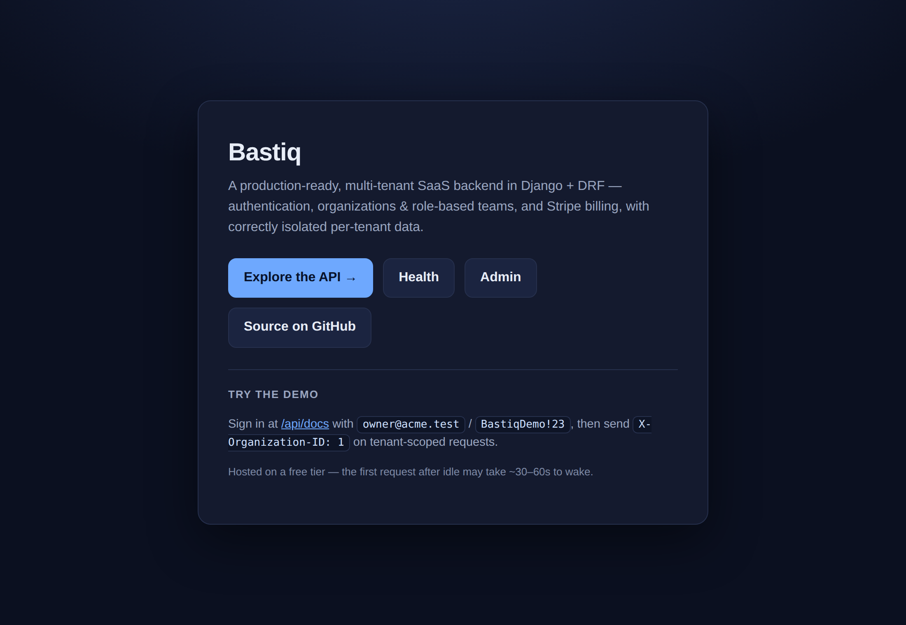
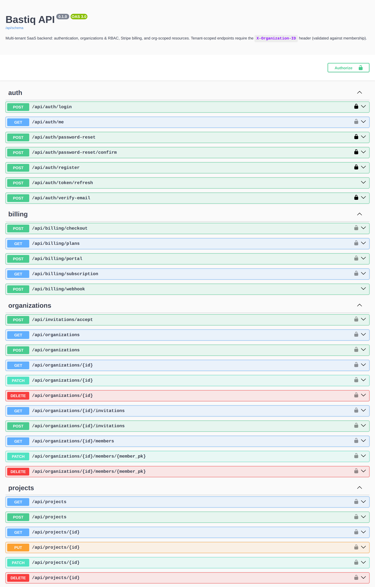
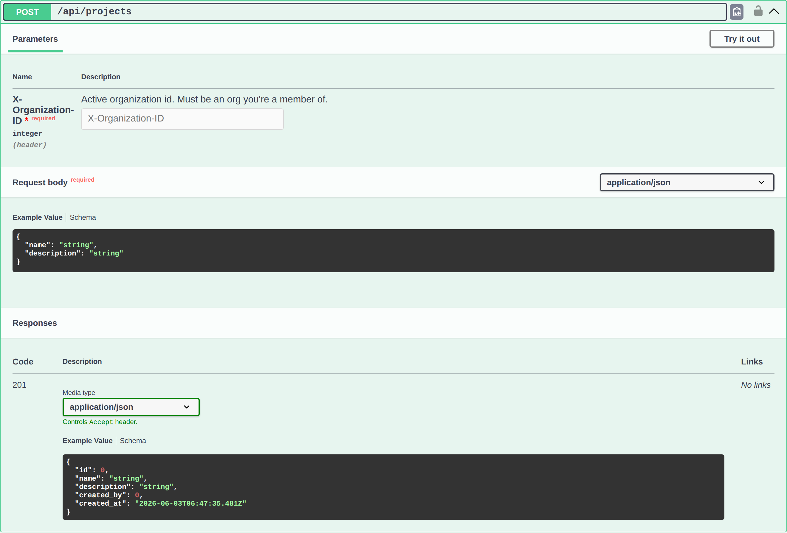
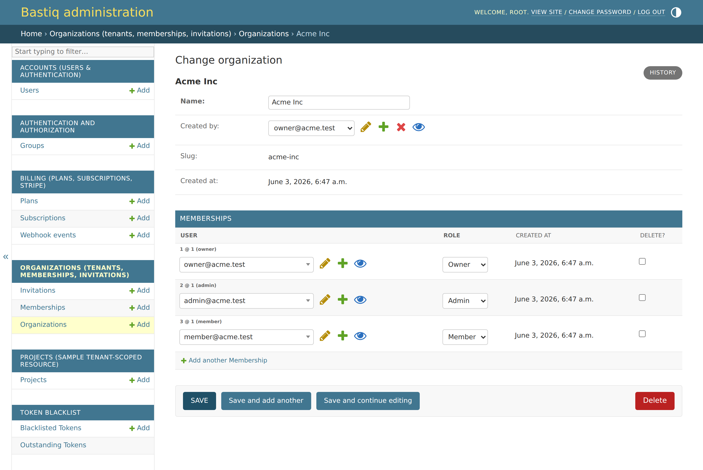

# Bastiq

A production-ready, multi-tenant SaaS backend in **Django + DRF** — the
foundation every B2B SaaS needs on day one: **authentication**, **organizations
with role-based teams**, and **Stripe subscription billing**, with **correctly
isolated per-tenant data** as the headline guarantee.

> **🚀 Live demo:** **<https://bastiq-web.onrender.com>** — the landing page, with
> the interactive **[API docs](https://bastiq-web.onrender.com/api/docs)** (Swagger)
> one click away. Sign in with `owner@acme.test` / `BastiqDemo!23` and send
> `X-Organization-ID: 1` on tenant-scoped calls. *(Hosted on a free tier, so the
> first request after idle may take ~30–60s to wake.)*

> A *bastion* is a walled, defended stronghold. Every tenant's data lives sealed
> behind its own walls — and that boundary is enforced in exactly one place.

Tenant isolation, the permission matrix, and billing correctness — the parts that
are tedious to get right and expensive to get wrong — are each solved once,
centrally, and proven with tests.

## Highlights

- **Tenant isolation as an invariant** — the active organization is resolved in a
  single audited permission class and enforced by one base viewset. No view can
  forget to scope a query. Cross-tenant access returns `404`, not `403` (you
  can't even learn a row exists).
- **A real RBAC matrix** — Owner / Admin / Member, with no-privilege-escalation
  and no-ownerless-org guards enforced at both the API and the model layer.
- **Billing you can trust** — the Stripe webhook is the source of truth:
  signature-verified, idempotent, and transactional. Plan limits are enforced
  server-side and race-safe.
- **Secure by default** — fail-closed config, email-based auth with single-use
  signed tokens, JWT rotation + blacklist, brute-force throttling, and prod
  security headers that switch on automatically.
- **Operationally complete** — Dockerised four-service stack, Celery for async
  email, OpenAPI/Swagger docs, seed data, a CI pipeline with a coverage gate, and
  a one-file Render deploy.

## Screenshots

**Landing page** (`/`) — an editorial front door: it states the guarantee, sums up
the three pillars (isolation · roles · billing), and drives to the live API docs:



**Interactive API docs (OpenAPI / Swagger)** — the whole surface, grouped by area,
generated from the code:



**The tenancy contract, visible in the docs** — every tenant-scoped endpoint
requires a validated `X-Organization-ID` header ("must be an org you're a member
of"), so isolation is part of the API contract, not an afterthought:



**Customized Django admin** — branded and org-scoped, with memberships and their
roles edited inline on the organization:



## Tech stack

Python 3.12 · Django 5.2 · Django REST Framework · PostgreSQL 16 · Celery + Redis
· djangorestframework-simplejwt · drf-spectacular (OpenAPI/Swagger) · Stripe ·
Docker / docker-compose · GitHub Actions CI · pytest + factory_boy · ruff ·
gunicorn + WhiteNoise · Render.

## Architecture

Five apps, and **all multi-tenancy isolation lives in `core/`**. Every request to
a tenant resource flows through the same four steps:

```
HTTP (DRF)
  1. JWT auth            → request.user                       (accounts)
  2. active-org resolve  → request.organization               (core: IsOrganizationMember — X-Organization-ID → Membership)
  3. role check          → RBAC matrix / CanWriteProject       (core.rbac)
  4. tenant queryset     → .filter(organization=request.org)   (core: TenantScopedViewSet)

core/          tenancy base classes, active-org resolution, permissions, RBAC matrix
accounts/      custom email-based User, auth views, /me
organizations/ Organization, Membership, Invitation + views
billing/       Plan, Subscription, WebhookEvent + Stripe + plan-limit enforcement
projects/      a sample tenant-scoped resource (isolation + RBAC + limits, end-to-end)
```

The Django project package is `bastiq/` (settings, urls, celery, wsgi/asgi). A new
tenant resource inherits `TenantScopedModel` + `TenantScopedViewSet` and gets
isolation, scoping, and create-stamping for free.

## Where to look first

If you're reviewing the code, the interesting parts are small and self-contained:

| Concern | File |
|---|---|
| Active-org resolution (the isolation perimeter) | `core/permissions.py` |
| Tenant scoping base class | `core/viewsets.py`, `core/models.py` |
| RBAC matrix + guards | `core/rbac.py` |
| Stripe webhook (idempotent, transactional) | `billing/webhooks.py`, `billing/views.py` |
| Server-side plan limits (race-safe) | `billing/limits.py` |
| Last-owner protection at the model layer | `organizations/models.py` |

## Quickstart (Docker)

```bash
docker compose up                                    # web + db + redis + worker
docker compose exec web python manage.py seed_demo   # demo org, users & projects
```

- Swagger UI: <http://localhost:8000/api/docs>
- Health: <http://localhost:8000/healthz> → `{"status": "ok"}`
- Admin: <http://localhost:8000/admin/> (`docker compose exec web python manage.py createsuperuser`)

### Demo credentials (from `seed_demo`)

Organization **Acme Inc** on the **Free** plan. All three users share the password
**`BastiqDemo!23`**. Use the org id printed by `seed_demo` as the
`X-Organization-ID` header for tenant-scoped requests.

| Email | Role |
|---|---|
| `owner@acme.test` | Owner |
| `admin@acme.test` | Admin |
| `member@acme.test` | Member |

## A guided walkthrough

The fastest way to see everything working, end to end, in Swagger:

1. **Register** → **verify email** (the token is printed to the logs — the Celery
   worker locally, or the web process on the free-tier deploy) → **login** for a JWT.
2. **Create an org** (you become its Owner) → **invite** a teammate
   (`POST /api/organizations/{id}/invitations`) → they **accept**
   (`POST /api/invitations/accept`).
3. **Create projects** up to the Free limit (3) with `X-Organization-ID` set; the
   4th is **blocked** with a clear `402 — plan limit reached`.
4. **Upgrade:** `POST /api/billing/checkout {plan_code: "pro"}` → pay in Stripe
   test Checkout with card `4242 4242 4242 4242` → the **webhook** flips the
   subscription to **Pro** → the 4th project now succeeds.
5. **Isolation:** switch `X-Organization-ID` to a second org → the first org's
   projects are **invisible** (`404`).
6. **RBAC:** a Member can't change roles or delete the org; an Owner can.

> On the **hosted demo**, steps 1–3, 5, and 6 work as-is. Step 4 (Stripe Checkout)
> needs Stripe keys, which the free-tier demo doesn't set — checkout returns a clean
> `503` there. Run it locally with Stripe configured to see Checkout end to end, or
> flip a plan from the admin (Billing → Subscriptions) to watch the limits lift.

## The three things that matter most

### (a) Multi-tenant isolation — the invariant
The active organization is resolved in exactly **one** audited place
(`core/permissions.py::IsOrganizationMember`): read from the `X-Organization-ID`
header, **validated against the caller's `Membership`**, then attached as
`request.organization`. A single base class
(`core/viewsets.py::TenantScopedViewSet`) filters every tenant queryset by it and
stamps it on create. The org is **never** read from the request body or query
params, so a user can't act on an org they don't belong to or smuggle another
org's id through a payload. Cross-org access returns **404**.

### (b) RBAC matrix
Roles rank **Owner (3) > Admin (2) > Member (1)** (`core/rbac.py`, asserted
cell-by-cell):

| Action | Owner | Admin | Member |
|---|---|---|---|
| Read org/members; read/create project | ✓ | ✓ | ✓ |
| Update org | ✓ | ✓ | ✗ |
| Delete org | ✓ | ✗ | ✗ |
| Invite member | ✓ (any role) | ✓ (≤ Admin) | ✗ |
| Change role / remove member | ✓ | ✓ (≤ Admin) | ✗ |
| Update/delete project | ✓ | ✓ | creator only |

Universal guards: **no escalation** (you can't grant a role above your own) and
**no ownerless org** (you can't demote or remove the last Owner) — enforced in the
API *and* in `Membership.clean()`/`delete()`, so the admin and shell can't orphan
an org either.

### (c) Stripe billing + webhook
The **webhook is the source of truth**, not the success redirect. It verifies the
`Stripe-Signature` on the raw request body, dedupes on
`WebhookEvent.stripe_event_id` (idempotent), and maps
`checkout.session.completed` / `customer.subscription.updated|deleted` /
`invoice.payment_failed` to local `Subscription` state — recording and processing
in **one transaction**, so a mid-flight failure simply reprocesses on Stripe's
retry. **Plan limits** are enforced server-side at creation time (projects and
members), locked against concurrent creates, and return `402` over the cap.

Plans: **Free** (3 projects / 3 members) · **Pro** (25 / 10) · **Business**
(unlimited).

## API surface

```
/api/auth/         register · verify-email · login · token/refresh · password-reset(/confirm) · me
/api/organizations/[{id}/[members/{mid} | invitations]]   · /api/invitations/accept
/api/projects/[{id}]          (tenant-scoped; requires X-Organization-ID)
/api/billing/      plans · subscription · checkout · portal · webhook
/api/docs          Swagger    · /api/schema    · /healthz
```

Auth: `Authorization: Bearer <access>`. Tenant resources also send
`X-Organization-ID: <org_id>` (validated against membership).

## Engineering rigor

- **~195 tests, ~95% coverage** spanning auth, isolation, the RBAC matrix, webhook
  idempotency, and plan limits.
- **CI** (GitHub Actions) runs ruff lint + format checks and the full suite
  against a real Postgres, with a **90% coverage gate** and a
  `makemigrations --check` guard against missing migrations.
- **OpenAPI schema validates with zero warnings**; the API is fully documented in
  Swagger.

## Configuration

All deployment config is environment-driven — see [`.env.example`](.env.example).
Production security (HSTS, secure cookies, SSL redirect, proxy SSL header) turns on
automatically when `DJANGO_DEBUG=false`, and a missing `DJANGO_SECRET_KEY` **aborts
startup** (fail-closed). Swagger is public by default for the demo; set
`DOCS_REQUIRE_AUTH=true` to lock it down. Secrets are never committed.
